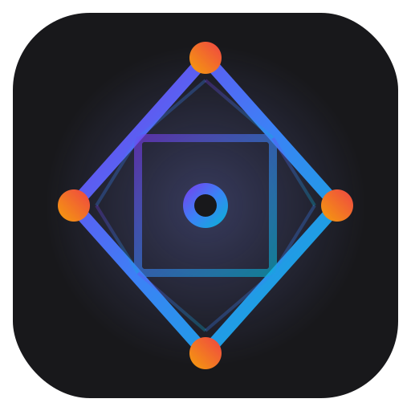

<p align="center">
  
</p>

<h1 align="center">Siljangnim</h1>

<p align="center">
  AI-powered real-time graphics creation tool.<br/>
  Describe visuals in natural language — AI generates WebGL2 shaders that render live in your browser.
</p>

<p align="center">
  <a href="https://siljangnim.vercel.app/">🌐 Try it online</a> · <a href="README.ko.md">한국어</a>
</p>


## What can it do?

**If you can imagine it, it can build it.** Need to load a 3D model? It writes the loader. Want audio-reactive visuals? It reads the file, analyzes the spectrum, and wires it to the shader. You don't write code — you describe what you want, and the agent figures out the rest.

Chat with the AI agent in plain language — it writes WebGL2 shaders, builds UI panels, and wires everything together in real-time.

### Visual Creation

Tell it what you want to see:

> "Make blue waves slowly crossing the screen"
>
> "Make a reaction-diffusion simulation with mouse interaction"
>
> "Create a raymarched scene with a reflective sphere on an infinite plane"

The agent writes GLSL shaders, compiles them, and renders them live — multi-pass buffers, 3D geometry, post-processing, all handled automatically.

### Auto-generated UI Controls

The agent creates interactive control panels based on what the scene needs:

> "Add a control panel to adjust color and speed"

It generates sliders, color pickers, toggles, 2D pads, dropdowns, camera orbit controls, buffer previews, and more. All controls are linked to shader uniforms with undo/redo and keyframe animation support.

```
┌─ Wave Controls ─────────────────┐
│ Speed       ●━━━━━━━━━━━  0.8   │
│ Amplitude   ━━━━●━━━━━━━  0.4   │
│ Color       [■ #3b82f6]        │
│ Wireframe   [  ○ OFF  ]        │
│ Shape       [ Sphere ▾ ]       │
└─────────────────────────────────┘
```

### Audio-reactive Visuals

Upload an audio file or use a URL — the agent analyzes bass/mid/treble, FFT, and waveform data in real-time:

> "Create visuals that react to this music — circles grow on bass, colors shift on highs"

### MediaPipe Hand/Pose/Face Tracking

Webcam-based real-time tracking using MediaPipe Vision:

> "Use the webcam for hand tracking — show a wireframe box when both hands pinch"

Supports 33-point body pose, 21-point hand landmarks (2 hands), and 478-point face mesh — all available as GPU textures for shader consumption.

### 3D Models & Skeletal Animation

Upload `.obj`, `.fbx`, `.gltf`, `.glb` files — the agent auto-processes geometry, materials, textures, and skeletal animation data:

> "Upload a character model and render it with rim lighting and idle animation"

### File Processing & Upload

Upload images, fonts, SVGs, audio, video, and 3D models. Each file is automatically processed into WebGL-ready derivatives (bitmap atlases, spectrograms, geometry JSON, etc.).

### Recording & Export

Record the viewport to MP4 (offline, frame-exact), WebM (realtime or offline), or PNG sequence (with optional alpha transparency) — configurable FPS, quality, and resolution.

### Timeline & Keyframe Animation

Animate any uniform over time with keyframes, cubic Hermite interpolation, and easing. Scrub, loop, and adjust duration from the timeline bar.

## Supported AI Providers

Siljangnim supports multiple AI providers. Choose one that fits your needs:

| Provider | Models | Best for |
|----------|--------|----------|
| **Anthropic (Claude)** | Claude Opus 4.6, Claude Sonnet 4.6 | Best quality, recommended for complex scenes |
| **OpenAI** | GPT-4.1 | Good alternative, strong tool calling |
| **Google Gemini** | Gemini 2.5 Flash | Fast, large context window |
| **Zhipu AI (GLM)** | GLM-4-Plus | Chinese language support |
| **Custom (OpenAI-compatible)** | Any model | Self-hosted / local models |

### Custom Model Setup (vLLM, Ollama, etc.)

You can connect any OpenAI-compatible API server — vLLM, Ollama, TGI, LM Studio, etc.

**Example: Running Qwen3.5-27B with vLLM**

```bash
# Start vLLM server
vllm serve Qwen/Qwen3.5-27B \
  --max-model-len 131072 \
  --enable-auto-tool-choice \
  --tool-call-parser hermes
```

Then in the app's API settings modal:
1. Select **Custom** provider
2. Set **Base URL** to your server (e.g. `http://localhost:8000/v1/`)
3. Set **Model Name** (e.g. `Qwen/Qwen3.5-27B`)
4. Set **Max Tokens** (e.g. `4096` — this is the max *output* length, not context size)
5. API Key is optional for local servers

> **Tip:** For best results with custom models, use models with 27B+ parameters that support tool calling. Smaller models may struggle with complex shader generation.

> **Tip:** `--max-model-len` controls how much of the model's context window vLLM allocates. Set it as high as your GPU memory allows — it is *not* the same as `max_tokens` in the app settings.

## Warnings

> **Security** — The AI agent can execute arbitrary Python code on the host machine. There is no container or OS-level sandbox. **Do not expose this application to the public internet.** See [Security Notice](#security-notice) for details.

> **Cost** — When using cloud APIs (Anthropic, OpenAI, Gemini, GLM), every chat message costs tokens. Complex scenes may trigger multiple tool-use rounds per prompt. A single conversation can easily use **$1–5+ of API credits**. Monitor your usage on your provider's dashboard. Self-hosted custom models have no per-token cost.

## Quick Start

**Prerequisites:** Python 3.10+, Node.js 18+, an API key from any [supported provider](#supported-ai-providers)

**macOS / Linux:**

```bash
git clone https://github.com/okdalto/siljangnim.git
cd siljangnim
chmod +x run.sh
./run.sh
```

**Windows:**

```powershell
git clone https://github.com/okdalto/siljangnim.git
cd siljangnim
run.bat
```

Open **http://localhost:5173**. Enter your API key when prompted — it saves to `backend/.env` automatically.

<details>
<summary><strong>Manual setup</strong></summary>

**macOS / Linux:**

```bash
# Backend
cd backend
python3 -m venv .venv && source .venv/bin/activate
pip install -r requirements.txt
echo "ANTHROPIC_API_KEY=sk-ant-..." > .env   # optional
uvicorn main:app --host 0.0.0.0 --port 8000 --reload

# Frontend (new terminal)
cd frontend
npm install
npm run dev -- --host 0.0.0.0 --port 5173
```

**Windows:**

```powershell
# Backend
cd backend
python -m venv .venv
.venv\Scripts\activate
pip install -r requirements.txt
echo ANTHROPIC_API_KEY=sk-ant-... > .env   # optional
uvicorn main:app --host 0.0.0.0 --port 8000 --reload

# Frontend (new terminal)
cd frontend
npm install
npm run dev -- --host 0.0.0.0 --port 5173
```

</details>

## Usage

1. **Describe the visuals you want in the chat** — in any language
2. **See results in the viewport** — shaders compile and render automatically
3. **Adjust parameters** — via auto-generated control panels
4. **Animate with the timeline** — keyframes, scrubbing, loop
5. **Record or save** — export video or save the project for later

| Key | Action |
|-----|--------|
| `Space` | Toggle play / pause |
| `Ctrl/Cmd + Z` | Undo (uniforms, layout, keyframes) |
| `Ctrl/Cmd + S` | Save project |

## Project Structure

```
siljangnim/
├── backend/
│   ├── main.py           # FastAPI server + WebSocket
│   ├── agents.py         # Claude agent (shader generation + UI control)
│   ├── workspace.py      # Sandboxed file I/O
│   ├── projects.py       # Project save/load
│   └── config.py         # API key management
├── frontend/
│   ├── src/
│   │   ├── App.jsx       # Main app + state management
│   │   ├── engine/       # GLEngine (WebGL2 renderer)
│   │   ├── nodes/        # ReactFlow nodes (chat, viewport, inspector, etc.)
│   │   └── components/   # Toolbar, Timeline, SnapGuides
│   └── package.json
├── .workspace/           # Runtime data (scenes, uploads, projects)
├── run.sh                # One-click startup script (macOS/Linux)
└── run.bat               # One-click startup script (Windows)
```

## Tech Stack

| Layer | Technology |
|-------|------------|
| Frontend | React 19, Vite, TailwindCSS v4, @xyflow/react |
| Rendering | WebGL2 (ES 3.0), custom GLEngine |
| Backend | FastAPI, WebSocket, Uvicorn |
| AI | Anthropic Claude, OpenAI, Gemini, GLM, or any OpenAI-compatible API |

## Security Notice

The AI agent can execute arbitrary Python code and whitelisted shell commands (`pip`, `ffmpeg`, `ffprobe`, `convert`, `magick`) on the host machine via `run_python` and `run_command` tools. While execution is restricted to the `.workspace/` working directory and shell commands are limited to a whitelist, **the Python code runs with the same permissions as the backend process** — there is no container or OS-level sandbox.

This means a prompt injection attack (e.g., via a maliciously crafted uploaded file) could potentially:
- Read or write files accessible to the backend process
- Install arbitrary packages via `pip`
- Exfiltrate data through installed packages or network calls

**Do not expose this application to the public internet.** It is designed for local, single-user use only. If you must run it on a shared network, place it behind authentication and consider running the backend inside a container.

## License

[GPLv3](LICENSE)
